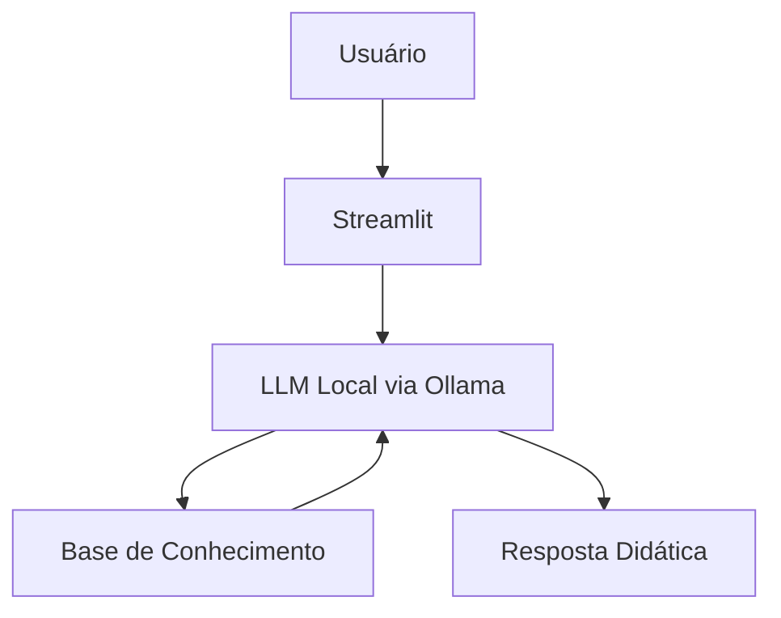

# Finn Ancer - Tutor de Análise Financeira

> Agente de IA Generativa criado para ensinar finanças e análise de dados financeiros para iniciantes, com linguagem acessível, exemplos práticos e foco educacional.

## O que é o Finn Ancer?

O **Finn Ancer** é um tutor de análise financeira voltado para pessoas que estão começando a estudar métricas, indicadores, cálculos e interpretação de dados financeiros.

Em vez de recomendar investimentos ou tomar decisões pelo usuário, ele foi projetado para **ensinar**. O agente explica conceitos como receita, lucro, margem, fluxo de caixa, ticket médio e outros KPIs financeiros usando uma abordagem didática, segura e contextualizada.

### O que o Finn faz

- ✅ Explica conceitos financeiros com linguagem simples
- ✅ Mostra fórmulas e interpretações de métricas financeiras
- ✅ Usa dados da base do projeto para gerar exemplos práticos
- ✅ Ajuda iniciantes a conectar finanças com análise de dados
- ✅ Responde de forma objetiva, educativa e alinhada ao contexto do usuário

### O que o Finn não faz

- ❌ Não recomenda investimentos ou ativos específicos
- ❌ Não fornece dados sensíveis ou informações de terceiros
- ❌ Não responde a temas fora do escopo financeiro do projeto
- ❌ Não substitui um especialista financeiro ou contábil

---

## Arquitetura



### Stack utilizada

- **Interface:** Streamlit
- **LLM:** Ollama
- **Modelo local atual:** `qwen3-vl:4b`
- **Dados:** arquivos CSV e JSON
- **Lógica da aplicação:** Python

---

## Estrutura do Projeto

```bash
.
├── README.md
├── assets/
├── data/
│   ├── historico_atendimento.csv
│   ├── perfil_aluno.json
│   ├── metricas_financeiras.json
│   └── transacoes.csv
├── docs/
│   ├── 01-documentacao-agente.md
│   ├── 02-base-conhecimento.md
│   ├── 03-prompts.md
│   ├── 04-metricas.md
│   └── 05-pitch.md
├── examples/
└── src/
    └── app.py
```

> **Nota importante:** o `app.py` atual referencia `perfil_aluno.json` e `metricas_financeiras.json`. Se a sua pasta `data/` ainda estiver com nomes antigos como `perfil_investidor.json` e `produtos_financeiros.json`, vale alinhar os nomes dos arquivos antes de executar a aplicação.

---

## Base de Conhecimento

O Finn Ancer utiliza uma base simples e objetiva, criada para sustentar respostas didáticas.

- **`historico_atendimento.csv`**: reúne dúvidas anteriores e temas recorrentes
- **`perfil_aluno.json`**: representa nível, objetivos e dificuldades do usuário
- **`metricas_financeiras.json`**: concentra conceitos, fórmulas, interpretações e exemplos de KPIs
- **`transacoes.csv`**: oferece dados fictícios para exemplos práticos e exercícios

Essa organização ajuda o agente a responder com mais consistência, reduz alucinações e aproxima a explicação do contexto de quem está aprendendo.

---

## Como Executar

### 1. Instale o Ollama

Baixe e instale o Ollama na sua máquina.

Depois, carregue o modelo utilizado no projeto:

```bash
ollama pull qwen3-vl:4b
ollama serve
```

### 2. Instale as dependências do projeto

```bash
pip install streamlit pandas requests
```

### 3. Execute a aplicação

```bash
streamlit run src/app.py
```

---

## Exemplo de Uso

**Pergunta:** `Qual a diferença entre receita e lucro?`

**Resposta esperada do Finn:**

> Receita é o valor total gerado pelo negócio antes dos custos e despesas. Lucro é o que sobra depois de descontar esses gastos. Por exemplo, se uma empresa vendeu R$ 10.000 e teve R$ 8.000 em custos e despesas, o lucro foi R$ 2.000.

**Pergunta:** `Se uma empresa teve receita de R$ 10.000, custos de R$ 6.000 e despesas de R$ 2.000, qual foi o lucro líquido e a margem líquida?`

**Resposta esperada do Finn:**

> O lucro líquido foi de R$ 2.000 e a margem líquida foi de 20%, usando a fórmula `(lucro líquido / receita) x 100`.

---

## Métricas de Avaliação

A avaliação do agente foi feita com testes manuais simples, adequados ao contexto de execução local.

| Métrica | Objetivo |
|--------|----------|
| Assertividade | Verificar se o agente explica corretamente conceitos financeiros básicos |
| Segurança | Verificar se o agente recusa pedidos sensíveis e evita exposição de dados |
| Coerência | Verificar se o agente realiza cálculos corretamente e mantém consistência conceitual |
| Fora do escopo | Verificar se o agente limita sua atuação ao domínio financeiro do projeto |
| Informação inexistente | Verificar se o agente admite ausência de dados sem inventar respostas |

---

## Diferenciais

- **Foco educacional:** o agente foi desenhado para ensinar, não para recomendar investimentos
- **Aplicação prática:** usa exemplos numéricos e métricas comuns no contexto de análise financeira
- **Execução local:** roda com Ollama, sem depender obrigatoriamente de APIs externas
- **Base estruturada:** combina perfil do aluno, histórico, métricas e dados de exemplo
- **Segurança de resposta:** foi orientado para não inventar dados e para admitir limites de informação

---

## Documentação Completa

A documentação do projeto está organizada na pasta `docs/`:

- `01-documentacao-agente.md` — caso de uso, persona e limitações
- `02-base-conhecimento.md` — estratégia da base de dados
- `03-prompts.md` — system prompt, exemplos e edge cases
- `04-metricas.md` — avaliação manual do agente
- `05-pitch.md` — apresentação textual da solução

---

## Possíveis Melhorias

- Uso de modelos locais mais modernos, com maior capacidade de raciocínio
- Integração com APIs de modelos avançados, como OpenAI e Claude
- Ampliação da base de conhecimento com novos perfis, métricas e casos práticos
- Melhor seleção automática de contexto para reduzir latência e melhorar precisão
- Evolução da interface com trilhas de aprendizagem e exemplos guiados
