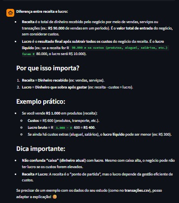

# Passo a Passo de Execução

## Sobre a Aplicação

Esta pasta contém o código-fonte do **Finn Ancer**, um tutor de análise financeira criado para ajudar pessoas iniciantes a aprender conceitos de finanças, métricas e cálculos básicos usados em análise de dados financeiros.

A aplicação foi desenvolvida em **Streamlit** e utiliza um modelo local rodando com **Ollama**, além da base de conhecimento em arquivos `.csv` e `.json` armazenados na pasta `data`.

---

## Setup do Ollama

Antes de rodar a aplicação, é necessário instalar e configurar o Ollama na sua máquina.

### 1. Instalar o Ollama

Baixe e instale o Ollama pelo site oficial.

### 2. Baixar o modelo utilizado no projeto

```bash
ollama pull qwen3-vl:4b
```

### 3. Testar se o modelo está funcionando

```bash
ollama run qwen3-vl:4b "Explique de forma simples o que é margem líquida."
```

---

## Base de Conhecimento Utilizada

O app utiliza os seguintes arquivos da pasta `data`:

- `historico_atendimento.csv`
- `transacoes.csv`
- `perfil_aluno.json`
- `metricas_financeiras.json`

Esses arquivos são usados para montar o contexto do agente, permitindo respostas mais didáticas, coerentes com o perfil do aluno e apoiadas por exemplos financeiros simples.

---

## Código Completo

Todo o código-fonte da aplicação está no arquivo:

```bash
src/app.py
```

---

## Como Rodar

### 1. Instalar as dependências

```bash
pip install streamlit pandas requests
```

### 2. Garantir que o Ollama está rodando

```bash
ollama serve
```

### 3. Rodar a aplicação

No terminal, a forma mais confiável é:

```bash
python -m streamlit run .\src\app.py
```

Se o comando `streamlit` estiver configurado no seu ambiente, também pode usar:

```bash
streamlit run .\src\app.py
```

---

## Funcionamento Esperado

Ao iniciar a aplicação:

- o app carrega os arquivos da base de conhecimento da pasta `data`;
- monta um contexto com perfil do aluno, histórico de dúvidas, transações e métricas financeiras;
- envia a pergunta do usuário junto do system prompt para o modelo local no Ollama;
- retorna uma resposta curta, didática e alinhada ao papel do Finn Ancer.

---

## Evidência de Execução

Adicione aqui um print da aplicação em funcionamento no navegador ou no terminal, mostrando o modelo local respondendo corretamente.

Exemplo:




